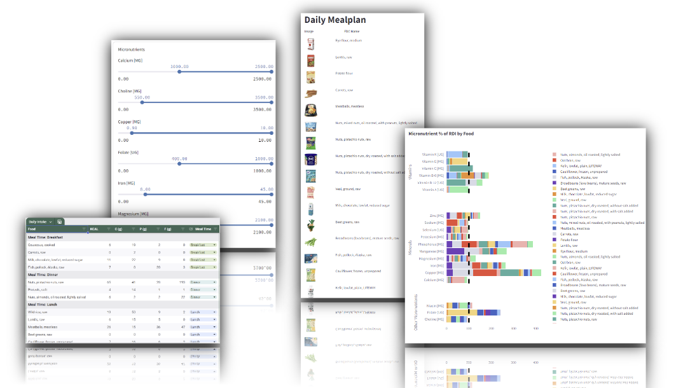

# Mealplan Streamlit App


## Overview

This project creates a [Mealplan Generator App](https://arthurzakirov-mealplan.streamlit.app/) designed to optimize numerous health metrics, accelerate fat loss, ensure the intake of essential micronutrients, and reduce costs to a budget-friendly level, all while maintaining a minimal daily time commitment.

## Features
 
- **Weight Management**: Effortlessly gain or lose weight to achieve your desired body composition goal by either manually setting the caloric intake or automatically generating a meal plan tailored to your specific needs based on your data.
- **Macronutrient Ratio Customization**: Default macronutrient settings are optimized for body composition goals based on recommendations by Mike Israetel, but you have the flexibility to adjust ratios to accommodate specific diets, including keto.
- **Optimal Fiber Intake**: Receive the ideal amount of fiber by default (or customize as needed), which is linked to various health outcomes.
- **Reduced Sugar and Saturated Fat**: Automatically limit undesirable macronutrients associated with negative health effects.
- **Micronutrient Compliance**: All generated meal plans meet the Recommended Daily Intake (RDI) for more than 20 micronutrients as listed by the USDA FoodData Central.
- **Financial Optimization**: Set a daily maximum food budget or mathematically optimize for the lowest possible price based on Rewe online shop pricing.
- **Optimal Fullness Factor**: Tailor your meal plan to be either very filling for those struggling to lose weight or less filling to help ectomorphs easily consume more calories and gain weight.
- **Minimized Insulin Response**: Generate meal plans that reduce your insulin response, helping to prevent a variety of negative health outcomes.
- **Time Efficiency**: Minimize the total time spent preparing all foods included in the meal plan.
- **Meal Plan Personalization**: Ensure that the meal plan generator only suggests foods you want, while also including your preferred items at all costs. The generator will then select remaining foods to maximize satisfaction of all previously mentioned criteria.
- **Dashboards**: Access an exact nutritional breakdown and additional optimization information in detailed dashboards.
- **Excel Meal Plan**: Download your meal plan in Excel format for easy reference.
- **Automated Shopping List**: Generate a weekly shopping list in Excel to ensure you can adhere to the daily meal plan that has been created.


## Prerequisites
- Python 3.8+

## Dataset Creation

To use this application, you first need to create a dataset using a different repository. Follow these steps:

1. Visit the [Dataset Creation Repo](https://github.com/ArthurZakirov/Food-Data-Pipeline) to create the required dataset.
2. After creating the dataset, save the final `nutrition_data.csv` file into the `data` folder inside this repository.

## Installation

### 1. **Clone the Repository**

```bash
   git clone https://github.com/arthurzakirov/Mealplan-Streamlit-App.git
 ```

 Navigate into the Repository
```bash
cd your-repo-name
```

### 2. **Set Up a Python Virtual Environment**
```bash
python -m venv venv
source venv/bin/activate  # On Windows use `venv\Scripts\activate`
 ```
### 3. **Install Dependencies**
```bash
pip install -r requirements.txt
```

## Usage
Run the Script
```bash
streamlit run app.py 
```

| Argument            |	Description                             |
|---------------------|-----------------------------------------|
| ```config/app_config.yaml``` | application configuration file |
| ```config/spreadsheet_config``` | spreadsheet configuration file |
| ```config/shopping_config```   | shopping list configuration file|


## Understand The Code

